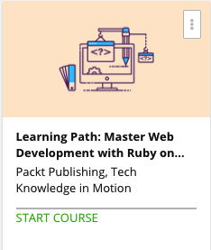

```
Roberto Nogueira  
BSd EE, MSd CE
Solution Integrator Experienced - Certified by Ericsson
```
# Udemy Learning Path: Master Web Development with Ruby on Rails 5



**About **

Learn everything you need to about the subject of this `Udemy` project.

[Homepage](https://www.udemy.com/learning-path-master-web-development-with-ruby-on-rails-5/learn/v4/content)

## Topics
```
Section: 1
0 / 11
Introducing Rails 5: Learning Web Development the Ruby Way
[ ] 1. What's New in ROR 5? 4:44
[ ] 2. Setting Up Rails 5 MVC 7:21
[ ] 3. Navigating and Seeding App 8:18
[ ] 4. Adding Routes and Authentication 6:10
[ ] 5. Creating and Subscribing to Channels 7:12
[ ] 6. Streaming and Rejecting Unauthorized Requests 7:23
[ ] 7. Broadcasting Messages to Channels 5:27
[ ] 8. Creating a Test Case Model-Todo App 9:09
[ ] 9. Application Visits and Restoration Visits 5:52
[ ] 10. Redirects, Forms, and Deletion with Turbolinks 11:07
[ ] Quiz 1: Test Your Knowledge 0:00

Section: 2
0 / 29
Expert Ruby on Rails 5
[ ] 11. The Course Overview 2:37
[ ] 12. Setting Up Ruby on Rails 13:32
[ ] 13. Cloud Deployment 5:19
[ ] 14. Rails 5 and Ruby 2.3.1 5:44
[ ] 15. Creating a New Rails 5 Project and Configuring an Alternative Database 6:49
[ ] 16. Application Structure 5:37
[ ] 17. Database 5:48
[ ] 18. Testing 7:21
[ ] 19. Authentication with Rails 5:35
[ ] 20. Installing and Configuring Devise 3:03
[ ] 21. Integrating Devise 6:18
[ ] 22. Customizing Devise 10:25
[ ] 23. Creating a Data Model 5:17
[ ] 24. Building Relationships 6:30
[ ] 25. Validations and Constraints 7:03
[ ] 26. Fixtures and Tests 6:06
[ ] 27. Routes and Resources 7:20
[ ] 28. Layouts and Stylesheets 14:09
[ ] 29. Controllers and Actions 13:12
[ ] 30. Testing Controllers 10:30
[ ] 31. RESTful APIs 10:17
[ ] 32. Creating an API Project with Rails 12:25
[ ] 33. Authenticating API Clients 13:28
[ ] 34. Refining the API 6:07
[ ] 35. Consuming the API 27:16
[ ] 36. What Is ActionCable? 3:25
[ ] 37. Setting Up for ActionCable 5:33
[ ] 38. Creating Notifications 7:29
[ ] Quiz 0: Test Your Knowledge 0:00
```
